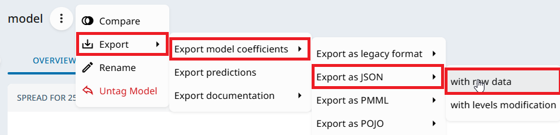
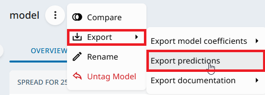

# predict_akur8

Akur8 model scorer with look-up tables interpolation.

## Installation

```bash
pip install git+https://github.com/PRICING-HELVETIA-FR/predict_akur8.git@main
```

## Usage

```python
from predict_akur8 import Akur8Model, report_unknown_values
import json

# Load JSON exported from Akur8
with open("export_json_akur8.json", "r", encoding="utf-8") as f:
    model_json = json.load(f)

model = Akur8Model(model_json, train_df=train_df, model_name="my_model")
scored = model.predict(df)
unknowns = report_unknown_values(scored)
```

`report_unknown_values` scans the scored dataframe and reports values that were
not found in the look-up tables. Missing coefficients are left empty, so the
corresponding predictions are empty as well. You can call this function once
after scoring with multiple Akur8 models to analyze all missing values in a
single pass.

## How to export the JSON from Akur8
Once a model is taged, it is possible to export its coefficients in JSON.
This JSON is required to create an instance of Akur8Model.



It is also possible to export predictions to check this module computes the same
predictions as Akur8 (with a small tolerance).



An interesting feature in "export predictions" is "export with extra options" :
it is possible to add columns in the exported database to have at least a
a key to merge predictions with the training dataframe. It is even possible to
add every column used by the model to get the training dataframe + predictions.

## Model initialization details

`Akur8Model(model_json, train_df=None, model_name=None, interpolate=True, compress_look_up_tables=True)`

- `model_name`: if set, it overrides `model_json["projectName"]` for all output column prefixes.
  If `None`, the JSON project name is used. Example output columns:
  `my_model::intercept`, `my_model::prediction`, `my_model::coef::age`,
  `my_model::coef::age x region`.
- `train_df`: when provided, variable types are inferred from the dataframe dtypes
  (numeric vs categorical) and numeric look-up tables are "completed" using the unique
  training values (nearest match as Akur8 does). This allows scoring values that exist in the
  training data but are not explicitly present in the JSON buckets. When
  `train_df` is omitted, types are inferred from JSON values only and no LUT
  completion is performed.
- `force_to_categorical`: set of variable that look like numerical but the user wants to force as 
  categorical (no completion, no interpolation, only exact matches). When train_df is supplied, 
  forcing is possible only when the number of distinct values is less or equal 256, otherwise it 
  will remain numerical. 
- `interpolate`: precomputes interpolation coefficients for numeric look-up tables so
  `linear` and `pchip` are available at scoring time.
- `compress_look_up_tables`: removes flat beta plateaus to speed up lookup
  without changing results.

## Pickle helpers

`to_pickle` / `from_pickle` serialize the fully prepared model (parsed look-up tables,
interpolation coefficients, compression, numpy look-up tables) for fast reload.

```python
model = Akur8Model(model_json, train_df=train_df)
model.to_pickle("model.pkl")

model2 = Akur8Model.from_pickle("model.pkl")
scored = model2.predict(df)
```

## Interpolation options

`predict` accepts a default interpolation and per-variable overrides:

```python
scored = model.predict(
    df,
    default_interpolation="pchip",
    interpolation_simple={"age": "linear"},
    interpolation_inter={("age", "duration"): "nearest"},
)
```

Supported methods for numeric features:
- `nearest`: closest grid value (no interpolation coefficients needed).
- `linear`: linear interpolation between grid points (requires `interpolate=True`).
- `pchip`: monotone cubic Hermite interpolation (requires `interpolate=True`).

Notes:
- For categorical variables, interpolation choice has no effect (direct mapping).
- For interactions, interpolation is applied on the second variable of the pair
  when it is numeric; for categorical x categorical pairs, the method is ignored.
- If train_df is not provided to Akur8Model, only the `nearest` interpolation method
  ensures to reproduce Akur8 predictions.
